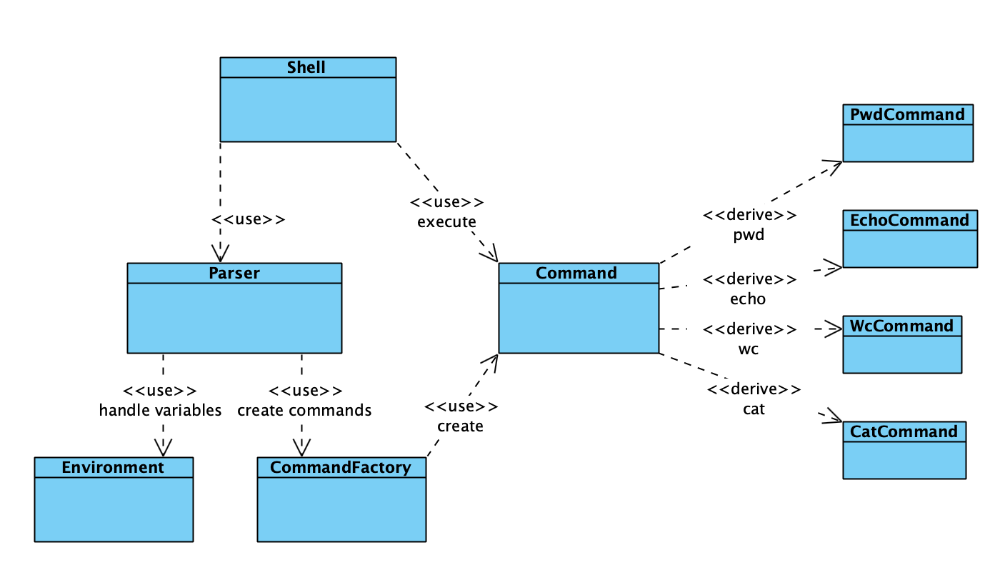

# CLI

## Основные классы

- Класс Shell является точкой входа в программу, а также содержит в себе основной цикл программы.
- Parser преобразует введенную строку в список командр для исполнения
- Environment зранит в себе значения переменных
- Command представляет общий интерфейс для комманд
- CommandFactory создает команды

## Цикл работы

- Введенная строка преобразуется в список токенов в методе tokenize класса Parser
- Производятся подстановки переменных в substitude класса Parser
- Токены группируются по командам, разделенных пайпом в groupByCommand класса Parser
- Из групп получаются соответствующие команды с помощью CommandFactory
- Команды по очереди исполняются из цикла внутри run класса Shell вызываются command.execute
- Результат выводится в основном цикле программы

## Диаграмма классов

 
